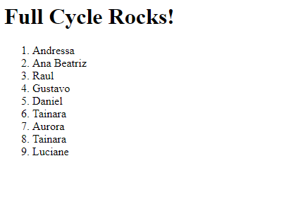

# full-cycle-docker-challenge

Repositório para entrega dos desafios de docker do curso Full Cycle

Link para a imagem do [Desafio Go](https://hub.docker.com/r/rafaelmaltez89/fullcycle)
Para conferir o desafio go, basta rodar o comando:

```bash
docker run rafaelmaltez89/fullcycle
```

Para conferir o resultado do desafio Nginx com Node.js, basta rodar o comando abaixo na raiz desse projeto:
```bash
docker-compose up
```
Caso não queira ver os logs, basta incluir a flag '-d' ao final do comando.

Após os containers estarem de pé, basta acessar o nagevador na url `http://localhost:8080` e verá uma saida como a da imagem abaixo:


A cada vez que atualizar a página, um nome é acrescentado à lista.